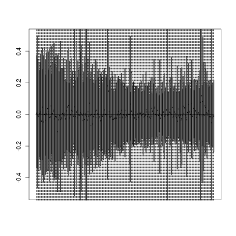
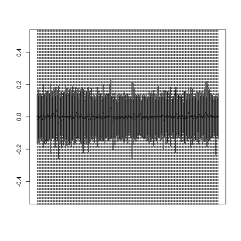
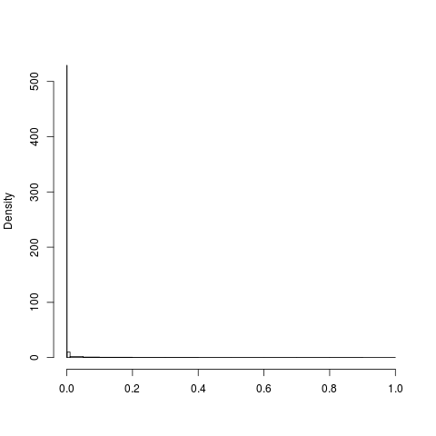
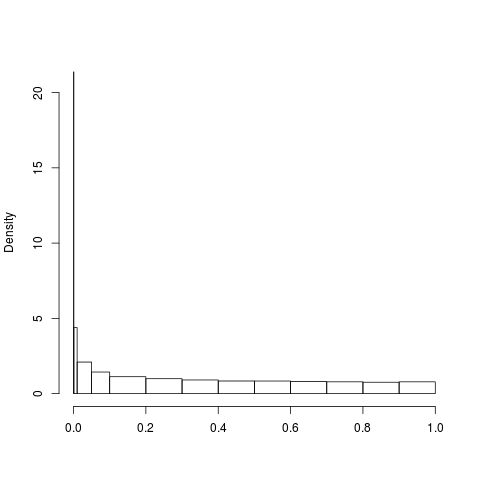

Smoller RUV-2 
========================================================


Array analysis for Erin Dunn (erindunn@pngu.mgh.harvard.edu) at MGH. Contact Meeta Mistry (mmistry@hsph.harvard.edu) for additional details. Request from client was:

Test for differential gene expression between brain samples taken at different ages as part of the [BrainCloud](http://braincloud.jhmi.edu/BrainCloudHelp.htm) project. 

> RNA from 269 human prefrontal cortex samples ranging from fetal development (negative ages) through aging (80 years) were analyzed on custom 2-color microarrays from the National Human Genome Research Institute (NHGRI) microarray core facility using a reference RNA comprised of a pool of all samples.

# Workflow
Try starting from the pre-'cleaned' data and remove the effects of confounders using [RUV-2](http://biostatistics.oxfordjournals.org/content/13/3/539.short).

## Setup

### Bioconductor and R libraries used


```r
library(ggplot2)
library(gtable)
library(scales)
library(RColorBrewer)
library(GEOquery)
library(affy)
library(arrayQualityMetrics)
library(reshape)
library(xtable)
library(ruv)
library(limma)
library(Biobase)
library(gridExtra)

# Grab John Hutchinson's convenience functions
source("http://dl.dropboxusercontent.com/u/4253254/Resources/functions.r")

# Grab my functions
source("~/R/scripts/useful_functions.R")
```


```r
# Setup directory variables
baseDir <- "."
dataDir <- file.path(baseDir, "data")
metaDir <- file.path(dataDir, "meta")
resultsDir <- file.path(baseDir, "results")
# covarsfilename <- 'covdesc.txt'
```


### Load the expression data


```r

# Load GEO data
gpl <- getGEO("GSE30272", destdir = file.path(dataDir, "geo"))
eset <- as(gpl$GSE30272_series_matrix.txt.gz, "ExpressionSet")

# Get expression data
expression <- exprs(eset)
colnames(expression) <- pData(eset)$title
dim(expression)
```

```
## [1] 30176   269
```


### Load the metadata and align with expression data


```r
meta <- read.table(file.path(metaDir, "brain_pheno2-txt.tsv"), header = TRUE, 
    sep = "\t", na.strings = "NULL", row.names = 1)

# Remove outlier samples
remove <- c(which(meta$Race == "HISP"), which(meta$Race == "AS"), which(meta$Gender == 
    5))
newMeta <- meta[-remove, ]
newMeta <- newMeta[order(newMeta$Age), ]

# Align metadata order with expression data
expression <- expression[, which(colnames(expression) %in% newMeta$geo_accession)]
rownames(newMeta) <- newMeta$geo_accession
newMeta <- newMeta[, -1]
newOrder <- match(colnames(expression), rownames(newMeta))
expression.meta <- newMeta[as.vector(newOrder), ]
all(colnames(expression) == rownames(expression.meta))
```

```
## [1] TRUE
```

```r

# Reassign the eset object
exprs(eset) <- expression
pData(eset) <- expression.meta
```


### Housekeeping genes
Our strategy with RUV is to use control genes. Negative control genes are genes whose expression levels are known a priori to be truly unassociated with the biological factor of interest. We'll use the 2003 list of housekeeping genes from Eisenberg and Levanon, 2003. ([Publication](http://www.sciencedirect.com.ezp-prod1.hul.harvard.edu/science/article/pii/S0168952503001409) found here), And filter out those unassociated with age, our factor of interest.


```r

# Load housekeeping gene list of accession numbers
hk.full <- read.delim(file.path(dataDir, "HK_genes_2003.txt"), header = T)

# Get all gene accession numbers
probe.acc <- as.character(fData(eset)[, "GB_ACC"])
x <- sapply(probe.acc, function(x) {
    strsplit(x, ".", fixed = T)[[1]][1]
})
probe.acc <- as.vector(x)

# Cross-reference the two
hk.use <- rownames(expression)[which(probe.acc %in% hk.full[, 1])]

# A quick DE analysis to find genes DE with age
mod <- model.matrix(~Age - 1, data = expression.meta)
fit <- lmFit(eset, mod)
fit <- eBayes(fit)

# Keep only HK genes that are not significantly associated with age
gene_list <- topTable(fit, number = nrow(exprs(eset)))
sig <- rownames(gene_list)[which(gene_list$adj.P.Val < 0.001)]
hk.use <- hk.use[which(hk.use %in% sig == FALSE)]
```

### RUV analysis
From the original list of 574 housekeeping genes we identified 209 as control genes for input to RUV.


```r

# Set up for RUV
mod <- model.matrix(~Age - 1, pData(eset))
X <- as.matrix(mod[, 1])
Y <- t(expression)
ctl <- rep("FALSE", nrow(expression))
ctl[which(rownames(expression) %in% hk.use)] <- "TRUE"
ctl <- as.logical(ctl)
```


```r

# A quick first look at the data
ruv_starter_analysis(Y, X, ctl)

```


Results from the RUV report can be found [here](https://dl.dropboxusercontent.com/s/n9q4tqmvt0iqm8e/index.html)


### Finding the optimal k value (number of SVs to include)
A critical step in RUV-2 is determining the number k of factors to remove. In general, this is difficult, and there is no clear way to determine k. Generally, RLE plots and p-value histograms have been found to be helpful. We can choose a k for which the expression is stable across samples. 

### Unadjusted RLE Plot


### RUV2 adjusted RLE plot (k=30)


### Unadjusted p-value distribution


### RUV2 adjusted RLE plot (k=30)


### Get cleaned data and check those same housekeeping genes.
Next step is to explore a couple of genes of interest. I picked the same six recommended genes from the previous analysis and added in random brain markers, including NR2A/B (Grin2a/b). Using the expression data with SVs from RUV regressed out, we look at expression change.


```r
# Subset expression data to genes of interest
hksub <- expression.annot[expression.annot$Gene_Symbol %in% c("C1orf43", "CHMP2A", 
    "GPI", "PSMB2", "REEP5", "SNRPD3", "GDNF", "NGF", "GRIN2B"), ]

# Merge with phenotype information
df <- melt(hksub)
df <- merge(df, expression.meta, by.x = "variable", by.y = "row.names")
```


Expression changes with age, our main interest compared to PMI. Even though the changes are not identical as we saw with the original cleaned [BrainCloud data](https://dl.dropboxusercontent.com/u/407047/Work/Smoller/brainCloud.html), we still see a similarity in the trend. 


